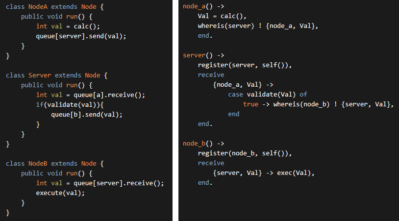

# Mir言語の基本概念

Mir言語の本質は以下の２点に集約されます。
- 一つの機能は一括で記述すること。
- 値やノードの依存関係を非巡回にすること。

つまり，複数ノードから成るシステムを記述するための言語として設計されています。

---
## 一つの機能は一括で記述すること

複数の計算機がネットワーク越しに通信し合うようなシステムを組む際，通信用のインターフェースを取り決めた後に実装をすることになると思います。
でもそれは（WebAPI等の開かれたシステム以外では）実装の結果生まれた物であることが多く，早すぎる具体化なのではないでしょうか。

---

例えば，以下のような処理をするシステムを考えます。
- Aが情報を投げる
- サーバで検査し中継する
- Bが受け取り実行

従来のプログラミング言語で疑似コードで表すと，概ね以下のような書き心地になるのではないでしょうか。



このように，ノードごとに処理を書く際の問題点として，
- ロジックが複数個所に分散する
- 寿命管理が困難になる
- モジュール同士の依存管理が困難になる
などが挙げられます。

---

そこで，以下のように記述できる言語を考えます。

```scala
NodeA [
	let val = calc();
	Server [
		if(validate(val)){
			NodeB [
				exec(val);
			]
		}
	]
]
```

このコードの本質的な処理内容を抜き出すと，システム全体が本来持つ処理内容を端的に表せていることが分かります。
```scala
let val = calc();
if(validate(val)){
	exec(val);
}
```

この処理を実際に各ノード上で実行するには，「どのノードで実行されるか」という情報が必要になります。

そこで登場するのが `Node[]` 表記です。
コードの各部分について「どこのノードで実行するのか」を注記することで，情報の所在や発生する通信について，同時に定義できます。

---

もっと実践的な例を考えてみましょう。
例えば，サーバ（Sとします）に2つのクライアント（それぞれA,Bとします）が接続しているゲームを考えます。

このゲーム上で「AがBを攻撃した」という処理を行うとき，システムとしては「`b.hp -= a.attack_power`」という処理が行われます。

この際，処理が行われる場所について，例えば以下のようなものが考えられます
- ステータス管理も攻撃処理もサーバで行う
  1. Aからサーバに，攻撃したことを報告する
  2. サーバから全体に，新たなBのHPを報告する
- ステータス管理は各個人で行い，攻撃処理は被攻撃者が行う
  1. Aからサーバに，攻撃したことと，その<u>攻撃力</u>を報告する
  2. サーバから<u>Bに</u>，攻撃を受けたことと，その攻撃力を報告する
  3. Bは，減算後のHPをサーバに報告する
- ステータス管理は各個人で行い，攻撃処理は攻撃者が行う
  1. Aから全体に，Bの新たなHPを報告する

<!-- これらは全て，システム全体で行っている処理は同じです。 -->
<!-- しかし実際にこれらを実装するとなると，プログラムの構造が大きく変化することと思います。 -->

先ほどの表記法で書き直してみると，それぞれ以下のようになりそうです。
- `S[b.hp -= a.attack_power]`
- `B[b.hp -= A[a.attack_power]]`
- `A[ b.hp -= a.attack_power ]`

ここで生じる疑問として，3つ目の処理において「Aから全体に通知をする」という処理がここから導けないのではないかと気づくことでしょう。

これらの計算結果を誰が管理し，各ノードがどのように取得するのかについては，後ほど議論します。（この文章を書いている時点ではどこの章で書くかは未定です）

ともあれ，各変数の単位（誰に対して定義されているか）と，その所有者（変数の問い合わせ先）を定義する必要があります。
この二つは同じものに見えるかもしれませんが，例えば「クライアントの人数分，サーバ側で保持する変数」といった物も考えられます。

では，ここまでを纏めて，疑似的なコードを書いてみます。

```scala
Network {
  S -> { A, B }
}

struct Player {
  int hp;
  int atk;
}
```

ケース1： ステータス管理も攻撃処理もサーバで行う
```scala
S[
  [A] Player a;
  [B] Player b;
]

A[
  when A.attack {
    S[ b.hp -= a.atk ];
  }
]
```

ケース2： ステータス管理は各個人で行い，攻撃処理は被攻撃者が行う
```scala
A[ Player a; ]
B[ Player b; ]

A[
  when A.attack {
    B[ b.hp -= a.atk ];
  }
]
```

ケース3： ステータス管理は各個人で行い，攻撃処理は攻撃者が行う
```scala
A[ Player a; ]
B[ Player b; ]

A[
  when A.attack {
    b.hp -= a.atk
  }
]
```

---

## 値やノードの依存関係を非巡回にすること

イベント駆動のシステムにおいて，基本的に各値は他の値に依存して決まります。
また，

